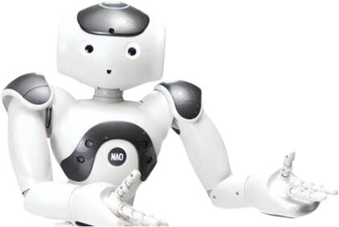

# robot-speech-to-speech 🤖🗣️
Pacte Novation Internship Project - 2024

**Implementation of a speech synthesis system based on speech recognition and LLMs for the NAO robot. 🤖💬** 

## Introduction

This repository contains the code for the Pacte Novation internship project of 2024. The goal of this project is to implement a speech synthesis system based on speech recognition and LLMs for the NAO robot.🎯

#### *How can we develop a conversational agent system based on hybrid artificial intelligence for the humanoid robot NAO, with the emphasis on personalising the dialogue?* 💡

The project is divided into three main parts:
 - [Data](data/) 📊 Contains the data used for the project.
 - [StateMachine](StateMachine/) 🛠️ Contains the different State Machines, this is the global architecture, and defines the way the different tools interact with each other.
 - [Tools](Tools/) 🔧 Contains the different tools used in the project. Each tool is a module that can be used to perform a specific task.